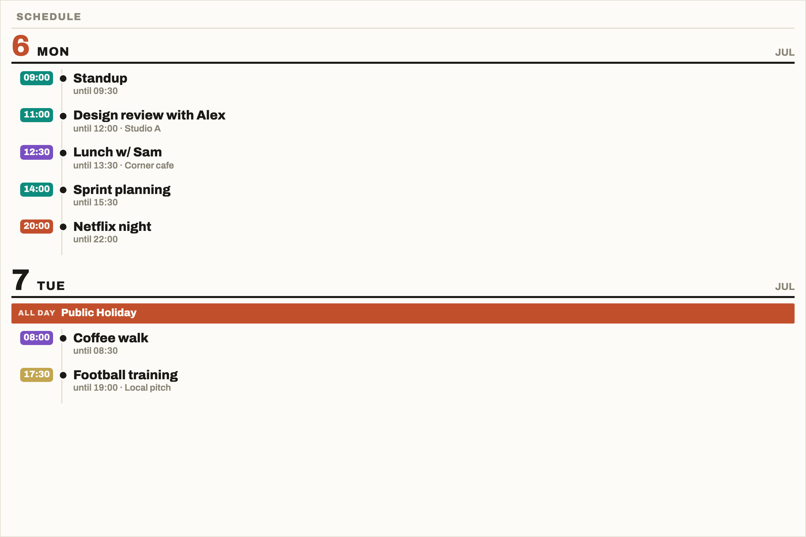
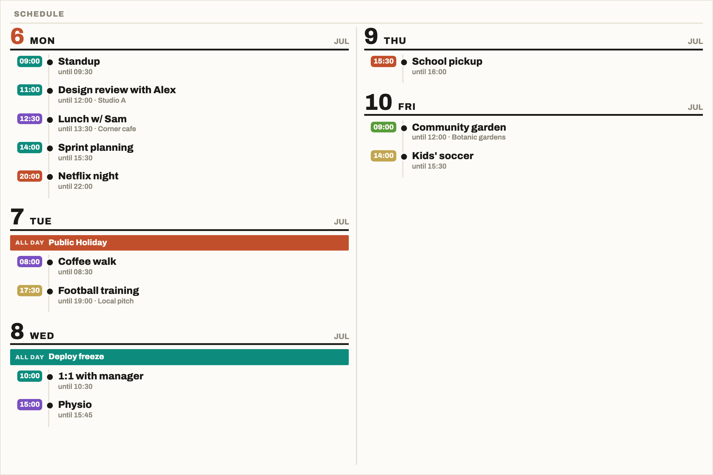
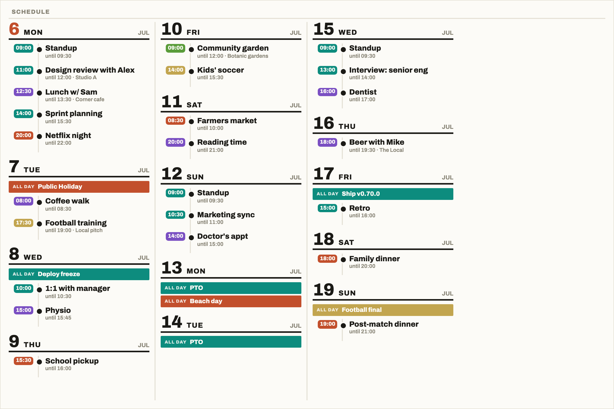
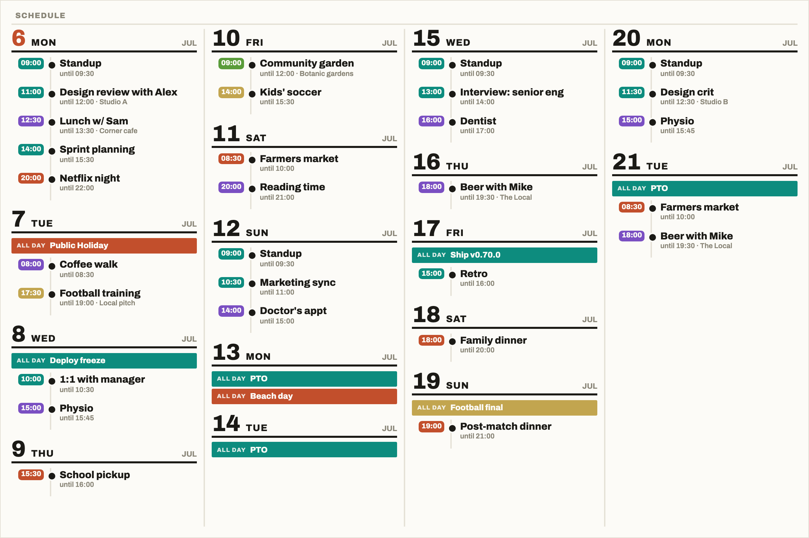

# Calendar, Schedule

A [Tesserae](https://github.com/dmellok/tesserae) widget that paints a timeline-rail agenda view: upcoming events grouped by day, with a thin ink rail connecting per-event nodes and a coloured start-time chip carrying the feed accent. Titles wrap freely so the widget stays legible from 1 up to 4 narrow columns on wide e-ink panels.

Reads from the same `calendar_core` feeds the other calendar_* widgets use. Drop in alongside `calendar_day` / `calendar_week` / `calendar_month`; pick which feeds to include per cell.

## Screenshots

Same widget in the same cell (1200 × 800), different values of `days_ahead` with `columns` on **Auto**. The layout grows only as far as it needs to.

| Auto, 2 days (1 col) | Auto, 5 days (2 col) |
|---|---|
|  |  |

| Auto, 14 days (4 col) | Auto, 16 days (4 col) |
|---|---|
|  |  |

## Install

Settings, Widgets, Browse community widgets, search "Calendar Schedule", Install. Restart Tesserae when prompted.

Make sure you have at least one feed configured in **Widgets → Calendar Feeds** (provided by `calendar_core`, ships bundled).

## Cell options

- **Days to show**: today only, 3 days, 5 days, a week, or two weeks.
- **Feed IDs**: restrict to specific feeds (comma-separated). Blank includes every enabled feed.
- **Hide events matching**: comma-separated words; any event whose title or location contains one is dropped. Case-insensitive and matches part of a word, so `lunch` hides "Lunch with Poppy". Useful for a recurring event you don't need on the panel.
- **Only show events matching**: the inverse, for when it's easier to say what you want than what you don't. Blank shows everything. Hide words still apply on top, so an event has to match this list and avoid that one.

  Both lists match against what the panel actually shows: with **Show event locations** off, locations aren't matched either, so a filter can't drop events for reasons you can't see on the screen.
- **Show event locations**: toggles the lighter-grey location text after the title.
- **Location style**: how much of the location fits under each event. **Full** wraps the whole string. **One line** keeps it to a single row and trims the end with an ellipsis. **Before the first comma** shows only the leading part, so "Cafe Rosa, 12 High St, Springfield" reads "Cafe Rosa" (a line break counts as a comma, for calendars that put the address on its own line), in a wrapping or a one-line, ellipsis-trimmed variant. Useful on small panels where addresses eat the cell. The keyword filters match the shortened text, so they still only act on what the panel shows.
- **Week number**: adds the ISO 8601 week number (`W38`) to the day header beside the month. **First day of each week** marks the first day shown from each week, so it appears once per week even when Monday is skipped for having no events; **Every day** repeats it on every header. Off by default. The label follows the panel language (`KW 38`, `S38`, `V38`).
- **Show per-feed colour dot**: turn off for pure typography (useful on 1-bit panels).
- **Use symbol dots**: replaces the round bullet on each timed event with a shape picked from the feed colour, so two calendars stay apart once the panel has quantised both to the same ink. Off by default. A symbol set on the feed itself (below) always wins over these.
- **Time format**: Auto, 24-hour, or 12-hour.
- **Skip days with no events**: when off, every day in the window renders even if empty.
- **Always show today**: keeps today's column even when it has no events, so the current date is always the first column. Only matters with **Skip days with no events** on.
- **Keep today's past events**: keeps today's events on the panel after they have ended, drawn in muted ink without the feed colour, so the day reads as a whole schedule rather than draining away through the afternoon. Off (the default) drops each timed event once its end time passes. Events from earlier days are never shown either way.
- **Max events per day**: cap each day's row count (0 = show all).
- **Layout columns**: flow the agenda across 1 to 4 vertical columns so a longer window (say two weeks) fits in a half-height cell without shrinking every row. Defaults to **Auto**, which starts at 1 and grows the column count only until the whole list fits; pick a fixed count (1-4) if you want to lock the layout. Days stay atomic (never split across columns); the browser packs by real content height, not day count.

Feed colour is carried by the start-time chip and the all-day bar. Turning off **Show per-feed colour dot** replaces the chip fill with ink for 1-bit panels.

**Use symbol dots** sorts each feed colour into one of 19 buckets (3 greyscale levels, then 8 hue slices each split by saturation) and draws that bucket's shape. Hollow shapes are the washed-out half of each hue, solid the vivid half.

Two colours in the same bucket get the same shape. The slices are 45 degrees wide, so the first one covers red through orange to yellow: on the stock Google Calendar palette that puts Tomato, Tangerine and Banana together, and the 11 stock colours resolve to 8 distinct shapes. If you're relying on this, set feed colours that sit well apart on the wheel rather than picking three warm ones.

All-day events render as a filled bar rather than a rail node, so they aren't affected. Turning off **Show per-feed colour dot** drops the colour before the client sees it, which collapses every symbol back to the plain bullet.

### Per-feed symbols

From Tesserae 0.418.0, each feed in Settings → Widgets → Calendar Feeds takes an optional **Symbol** (an emoji or a short marker) beside its colour. When a feed has one, this widget draws it as the rail node of every timed event from that feed, whatever **Use symbol dots** is set to, and puts it in front of the title on all-day bars. Feeds without one behave as before. This is the way to tell calendars apart by choice rather than by colour bucket, and it works for Home Assistant calendars too.

### Sensible column defaults per panel

Leave it on **Auto** if you don't know what to pick. When you want to force a specific layout, the rough guide is:

| Panel                                  | Suggested `columns` |
|----------------------------------------|---------------------|
| ≤ 800 px wide (TRMNL, small mono)      | 1                   |
| 1200 wide portrait (E1004, EE02)       | 2                   |
| 1600 wide landscape (Inky 13.3")       | 2 or 3              |
| 1872 wide landscape (E1003, TRMNL X)   | 3                   |
| very wide desks / kiosks               | 4                   |

The multi-column flow reads column-first: day 1 top-left, day 2 below it, wrap to top of column 2 when column 1 fills.

## Layout

Each day is a header (big day number + weekday, muted month right-aligned, optional week number) with a thick ink underline, followed by any all-day events as coloured bars, then a timeline rail of timed events. A multi-day all-day event shows on every day it covers; the days it carries on past are badged with the date it ends (`→ AUG 20`). Each timed event has a coloured start-time chip on the left, a rail-node dot on a 2px vertical spine, and a wrapping title with `until <end time> · <location>` beneath. Days stay atomic across columns (never split).

```
6  MON                                                   JUL
[09:00] •  Standup
           until 09:30
[11:00] •  Design review with Alex
           until 12:00 · Studio A
[12:30] •  Lunch w/ Sam
           until 13:30 · Corner cafe

7  TUE                                                   JUL
[ ALL DAY  Public Holiday                                    ]
[08:00] •  Coffee walk
           until 08:30
```

The first day in the window is highlighted as "today" (accent-coloured day number).

## Languages

Panel text follows the panel's language (Settings → Devices, or the app-wide
default under Settings → Server). Weekday and month labels come from the
browser's own locale data via `Intl`, so they need no translation. The
handful of fixed phrases ("Schedule", "ALL DAY", "until", "(no events)" and
so on) live in `strings/<tag>.json`; English, French, German and Swedish ship today.

To add a language, copy `strings/en.json` to `strings/<tag>.json`, translate
the values (keep the keys), add the tag to `locales` in `plugin.json`, and
open a PR. The 12-hour time chip uses the locale's own am/pm marker when it
is short enough to fit; pick **24-hour** under Time format for languages
where it isn't.

## Timezone handling

Day grouping happens server-side using your **Settings → Timezone** setting, so an event at 23:00 UTC on Wed renders under Thu's bucket for a user in Europe/Berlin (UTC+2). Time strings ("3:45 – 4:45pm") are formatted client-side, also in that zone (Tesserae 0.44.10+ forwards the setting to the rendering Chromium so the device frame matches the preview).

## What you need

- `calendar_core` plugin installed (ships bundled with Tesserae).
- At least one iCal feed configured in **Widgets → Calendar Feeds**. Google Calendar / iCloud / Outlook all expose private iCal URLs you can paste.
- Tesserae's renderer reaches the iCal URL(s) you configured. The widget's network access goes through `calendar_core`'s `needs_network: true` block.

## Caveats

- Agenda layouts are text-dense by nature. At very small cell sizes (xs / sm), expect long event titles to truncate with an ellipsis and locations to be hidden. Increase `max_events_per_day` or pick a larger cell if you find it crowded.
- The screenshot reference uses Google's design language; the widget aims for a similar feel but inherits Tesserae's theme tokens (`--text-primary`, `--surface`, `--accent`) so it slots into whatever theme your dashboard uses.
- Recurring events expand server-side via `recurring_ical_events` (the same path the other calendar_* widgets use). Exceptions and EXDATEs are honoured.

## Licence

AGPL-3.0-or-later.
